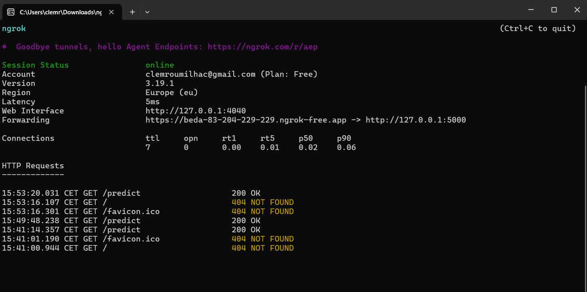

# DecentralizationTechnologiesTD3
*Avec Clément R. et Ibrahim S.*

Rapport du TD3 de Decentralization Technologies

Python a été utilisé pour les scripts de ce TD.
Toutes les librairies utilisées sont dans *requirements.txt*

## Practical Exercise: From Local to Decentralized Computation
*De Q1 à Q4*

Voir les scripts dans **'Practical Exercise: From Local to Decentralized Computation'**

Pour cet exercice, nous avons décidé de travailler sur la database *Iris*.

Chaque membre du groupe a développé un model de prediction :
- Random Forest : Clément
- Logistic Regression : Ibrahim
- KNN : Aurélien

Nous avons développé une API commune pour chaque model :
*(Exemple de requête : http://127.0.0.1:5000/predict?sepal\_length=5.1&sepal\_width=3.5&petal\_length=1.4&petal\_width=0.2)*

- api_knn.py

- api_rf.py

- api_lr.py

Nous avons ensuite créé nos comptes ngrok pour les rendre accessibles à tous :

Enfin, nous avons développé une API commune :
- consensus_API.py

Et voilà le résultat final :
*(Exemple de requête ATTENTION à la ROUTE 'consensus' : http://127.0.0.1:5001/consensus?sepal\_length=5.1&sepal\_width=3.5&petal\_length=1.4&petal\_width=0.2)*

Pour le reste des questions, on nous demande d'améliorer l'API en ajoutant des poids *(Voir le script 'consensus_API\_weight.py')*

*NOTE* : Pour tester, penser à changer les adresses ngrok avec les nouvelles

## B - E-commerce - Importance of redundancy

### Exercice - Simple Hello World Server

Voir les scripts dans **'E-commerce/Simple Hello World Server'**

### Exercice - Simple e-commerce

Voir les scripts dans **'E-commerce/Simple e-commerce'**

